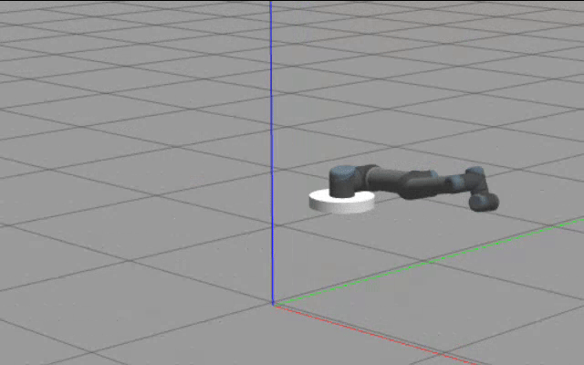
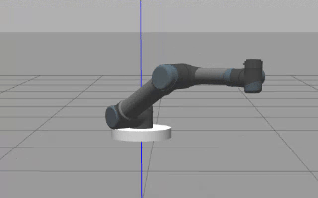
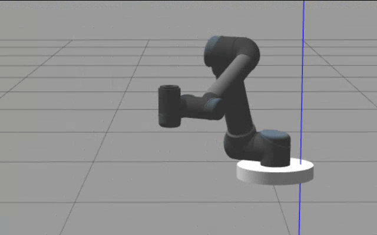

# Mobile Manipulator

## Table of Contents
- [Introduction](#introduction)  
- [Installation](#installation)  
- [Usage](#usage)  
- [Directory Structure](#directory-structure)  
- [Contact](#contact)  

---

## Introduction

This project simulates and controls a **mobile manipulator** using the [UR5 robot arm](https://github.com/UniversalRobots/Universal_Robots_ROS2_Description) with a floating base in a ROS 2 environment. It consists of two main tasks:

### Task 1: Floating Base Control with Joint Motion
A custom ROS 2 node publishes:
- Desired **joint angles** using sinusoidal functions
- A **circular trajectory** for the floating base (in `x`, `y`, `θ`)

This simulates coordinated motion of a mobile base and a 6-DOF arm.

### Task 2: Cartesian Motion Library
A custom motion generation library provides:
- **Linear Cartesian Motion**: Generates motion between two poses with velocity and acceleration control
- **Redundant Motion**: Tracks a **fixed Cartesian point** with the end-effector, while the base moves along a **straight line**—leveraging the robot's redundancy

The output trajectories are sent to the node from Task 1 for execution.

---

## Installation

### Requirements
- Ubuntu 22.04
- ROS 2 Humble
- C++ compiler with C++17 support

### Steps

1. **Install ROS 2 Humble**  
   Follow the official guide: https://docs.ros.org/en/humble/Installation.html

2. **Install dependencies**
   ```bash
   sudo apt update
   sudo apt install ros-humble-kdl-parser ros-humble-urdfdom \
                    ros-humble-trajectory-msgs ros-humble-sensor-msgs \
                    ros-humble-visualization-msgs ros-humble-rviz2
   ```
3. **Create worspace and clone repository**
   ```bash
   mkdir -p ~/MobileManipulation/
   cd ~/MobileManipulation/
   git clone https://github.com/Malattar99/MobileManipulation.git
   ```

4. **Build the workspace**
   ```bash
   cd ~/MobileManipulation
   colcon build
   ```

5. **Source the workspace**
   ```bash
   source install/setup.bash
   ```
   
## Usage

### Task 1: Sinusoidal Joint Motion + Circular Base
   Run:
   ```bash
   ros2 launch robot_model task_1.launch.py
```


### Task 2.1: Linear Cartesian Motion
   ```bash
   ros2 launch robot_model task_2a.launch.py
```

### Task 2.2: TCP Tracking + Base Motion
   ```bash
   ros2 launch robot_model task_2b.launch.py
```


---
## Directory Structure

Key directories:
- `robot_model/`: Contains robot description (URDF) and launch files
- `joint_commander/`: Implementation for Task 1 (joint + base motion)
- `motion_commander/`: Library for Cartesian motion (Task 2)


---
## Contact
For questions or suggestions, feel free to reach out via GitHub Issues or contact:
mohamadalattar1999@hotmail.com
